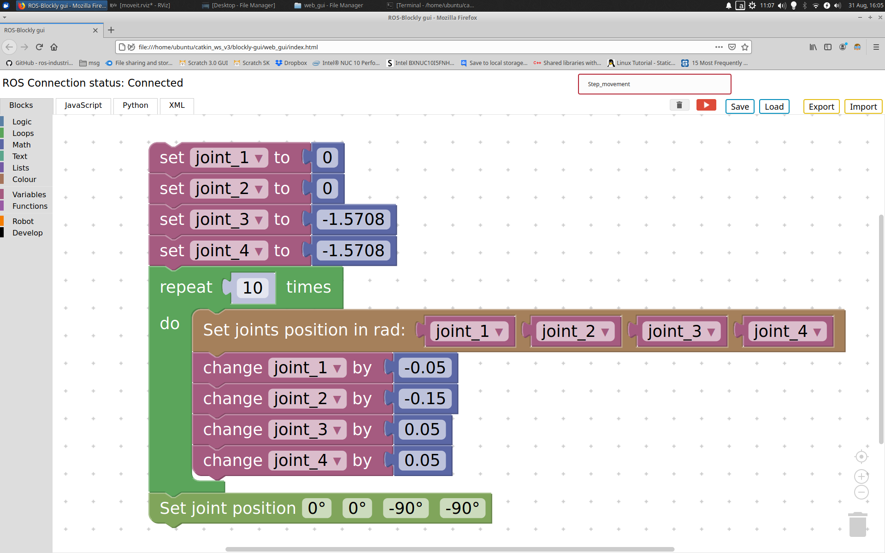

# Block based Graphical User Interface for GverilaBot
> This is working prototype.



Prerequisites:
* Ubuntu 18.04 [[Desktop version](https://releases.ubuntu.com/18.04.5/), [Raspberry Pi 4](https://ubuntu.com/download/raspberry-pi)]
* ROS Melodic  (other versions are not supported)
## Instructions:

1. Install [GverilaBot](https://github.com/SimonKajsner/GverilaBot_ROS) ROS stack.

2. Create folder and clone GverilaBot_GUI repository.
```
mkdir -p  ~/GverilaBot_GUI/web_gui
cd ~/GverilaBot_GUI/web_gui
git clone https://github.com/SimonKajsner/GverilaBot_ROS.git
```
3. Launch GverilaBot simulation in new terminal.
```
roslaunch rls_robot_v3_bringup rls_robot_v3_bringup_simulation.launch 
```
4. Open [index.html](index.html) file with your favourite web browser and **start programming**. 

